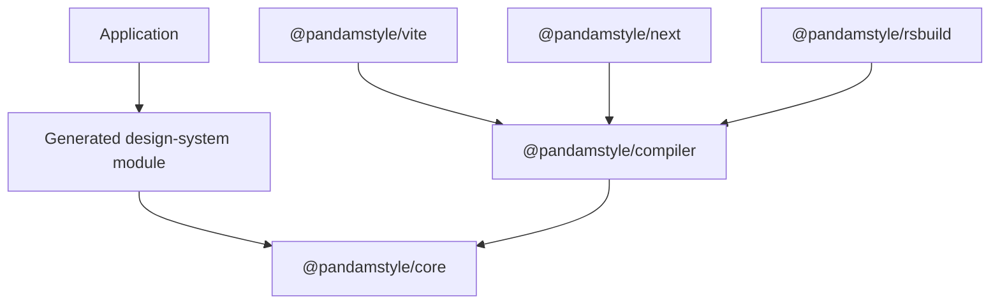

# PandamStyle package architecture v1

Alpha 1 consists of five packages with separate runtime, compiler, and host
integration responsibilities.

| Package | Responsibility | Runs in |
| --- | --- | --- |
| `@pandamstyle/core` | Runtime composition for generated style and theme references | Application runtime |
| `@pandamstyle/compiler` | Definition loading, Project Service, compilation, diagnostics, generated types, and CLI | Node.js build process |
| `@pandamstyle/vite` | Vite integration with the compiler service | Vite configuration/build process |
| `@pandamstyle/next` | Next.js integration with explicit webpack or Turbopack modes | Next.js configuration/build process |
| `@pandamstyle/rsbuild` | Rsbuild integration with the compiler service | Rsbuild configuration/build process |

Exact host versions and qualified commands are recorded in the
[installation contract](../agent-install.md). Package peer ranges describe
installation compatibility; they do not qualify additional host combinations.

## Dependency boundaries

The application runtime does not import the compiler or a host adapter. The
compiler owns style semantics, source analysis, generated artifacts, and
publication. Host integrations own framework lifecycle and bundler transport;
they consume the compiler service rather than maintaining separate compiler
state.

## Generated output and publication

The compiler produces a revision-bound design module, declarations, manifest,
artifact metadata, and extracted CSS. It stages and validates the complete set
before publishing. A host can consume an identified immutable snapshot but
cannot rewrite generated output or commit an alternate artifact set.

## Attribution

The compiler includes code derived from upstream open-source projects. Its
license headers, [`ATTRIBUTIONS.md`](../../ATTRIBUTIONS.md), and license files
identify those sources and their licenses.
